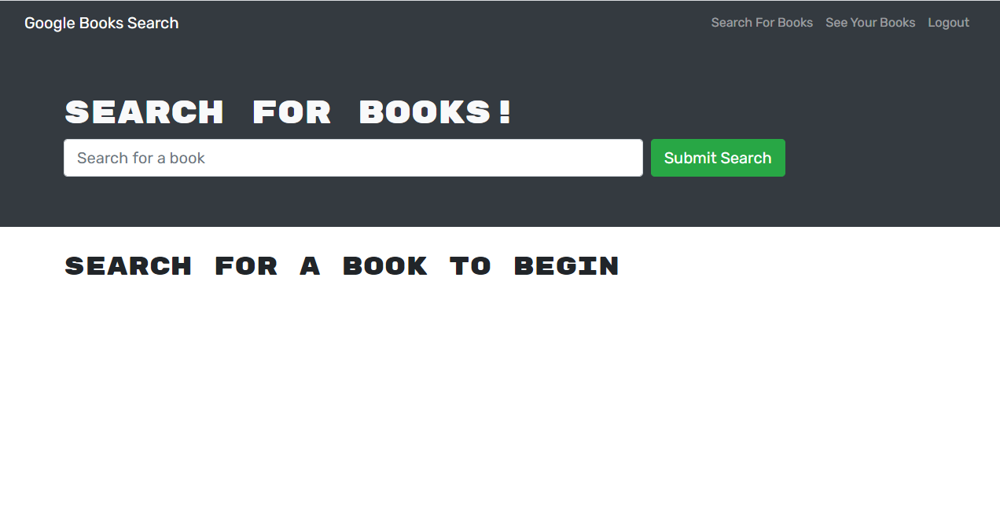

# Book Search Engine

## Description
        
This is an application that allows the user to search for books about various subjects and save them to their profile.

Deployed Application [https://mslnance-book-search-engine.herokuapp.com//](https://mslnance-book-search-engine.herokuapp.com/)

## Table of Contents

* [Installation](#installation)
* [Usage](#usage)
* [Credits](#credits)
* [License](#license)

## Installation

* Navigate to [https://github.com/mslnance/book-search-engine](https://github.com/mslnance/book-search-engine). 
* Click the 'code' button and download the zip file.
* Unzip the file on your computer.
* Open your terminal navigate to the root folder of your project and type 'npm start'

## Usage

Once you've downloaded the code open the zipped folder in an IDE.

Then open a terminal, cd to the root folder of the project nad type 'npm i'. From there you need to create a .env file to add the db name, username and password for your database. After you can run 'npm start' to run the application.

## Credits

[Laquesha Nance](https://github.com/mslnance)  updated this code to follow accessibility standards.

## License

MIT License

Copyright (c) [2020]

Permission is hereby granted, free of charge, to any person obtaining a copy
of this software and associated documentation files (the "Software"), to deal
in the Software without restriction, including without limitation the rights
to use, copy, modify, merge, publish, distribute, sublicense, and/or sell
copies of the Software, and to permit persons to whom the Software is
furnished to do so, subject to the following conditions:

The above copyright notice and this permission notice shall be included in all
copies or substantial portions of the Software.

THE SOFTWARE IS PROVIDED "AS IS", WITHOUT WARRANTY OF ANY KIND, EXPRESS OR
IMPLIED, INCLUDING BUT NOT LIMITED TO THE WARRANTIES OF MERCHANTABILITY,
FITNESS FOR A PARTICULAR PURPOSE AND NONINFRINGEMENT. IN NO EVENT SHALL THE
AUTHORS OR COPYRIGHT HOLDERS BE LIABLE FOR ANY CLAIM, DAMAGES OR OTHER
LIABILITY, WHETHER IN AN ACTION OF CONTRACT, TORT OR OTHERWISE, ARISING FROM,
OUT OF OR IN CONNECTION WITH THE SOFTWARE OR THE USE OR OTHER DEALINGS IN THE
SOFTWARE.